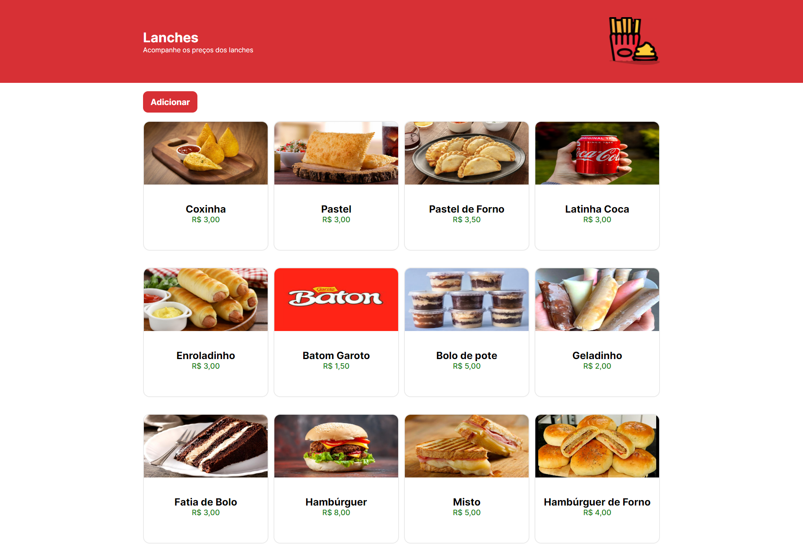

# **LanchoneteApp**

LanchoneteApp is a full-stack volunteer project developed using React, TypeScript, Node.js, and Express. The main objective of the project is to centralize all the snacks with their prices to solve the problem of not knowing the price of a particular snack or even forgetting it. LanchoneteApp lists all the products with their images, names, and prices. Currently, the project only has the functionality to add products, but there are plans for future implementations to update and delete snack data.

## **Features**

* Add snacks: Users can add new snacks to the system by providing the snack's image, name, and price.
* List snacks: The application displays all the snacks available, showing their images, names, and prices.

## **Future Implementations**

The project is still under development, and the following features are planned to be implemented in the future:

* Update snacks: Allowing users to update the information (name, price, image) of existing snacks.
* Delete snacks: Allowing users to remove snacks from the system.

## **Contributing**

Contributions to LanchoneteApp are always welcome! If you want to contribute, please follow these steps:

1. Fork the repository.
2. Create a new branch for your feature or bug fix.
3. Commit your changes and push the branch to your fork.
4. Submit a pull request explaining your changes.

## **License**
This project is licensed under the MIT License.
